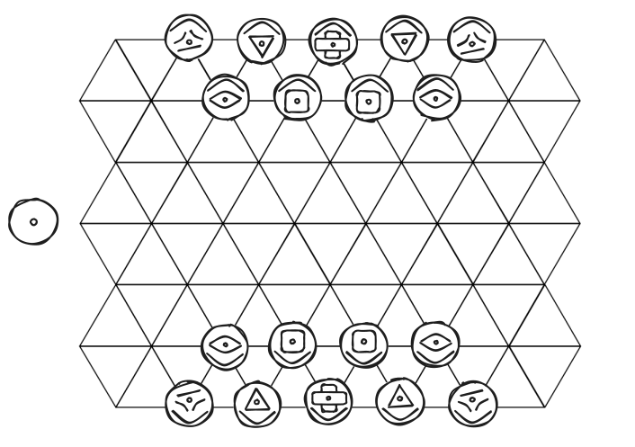

# Ludus Cyclorum

- [Ludus Cyclorum](#ludus-cyclorum)
  - [1. Introduction](#1-introduction)
  - [2. How to Play](#2-how-to-play)
  - [3. Rules](#3-rules)
    - [Stone Symbols](#stone-symbols)
  - [4. Variation and Exploration](#4-variation-and-exploration)

## 1. Introduction

Ludus Cyclorum is a print &amp; play game inspired by *chess*, *war games* and (thematically) the roman *ludus latrunculorum*. It is an abstract strategy game where you and an opponent fight by taking turns, acting with one piece each. Your pieces, with varying rules for movement and attacks, are led by your "Dux". You win once the opposing Dux is taken or left without allies. Every piece on the board must be activated before any single one may be used again. Whenever all pieces have been activated, a "cycle" is completed, hence the name "Ludus Cyclorum" - the game of cycles. I invite you to play it, share opinions and ideas or discuss with me [on discord](https://discord.com/invite/QFY5Qe8).

## 2. How to Play

First you should read the rules, there aren't very many. To play digitally I made a rudimentary draft for Tabletop Simulator, which is available on the [steam workshop](https://steamcommunity.com/sharedfiles/filedetails/?id=3402161640).

For physical play you'll need a board and the pieces. An image of the board I use is available in the repository as "board.pdf". Instead of printing it you can also just draw the lines on a piece of paper. I created my set of pieces by using german cents which I cleaned and then drew on with a marker. What to draw on your pieces can be seen in the rules (but this is of course ultimately up to you). Using a base that you can easily flip over is essential.

## 3. Rules

The current board and starting positions look like this: 

As you can see, pieces (from now on called stones) are placed on line intersections. The arrows on the stones indicate which player they belong to (if the arrow points towards you, it is yours). The dot in the center of each stone indicates its current "phase". Next to the board is the "cycle-indicator". The back and front of each stone (and the cycle-indicator) are mostly identical, only one side features the dot and the other instead a tilde (representing ebb and flow). All stones also feature their "symbol": crosses are Dux, triangles are spears, squares are shields, eyes are swords and riders remain.

Now for the complete rules:
1. Set up the board and pieces as shown in the graphic
2. Your win condition is to take the opposing Dux or their party
3. Determine the starting player somehow (coin flip, rock-paper-scissors, dice, etc.)
4. You and your opponent go back and forth "activating" a single one of your stones, then flipping it over (indicating that it is now "active", or "busy")
   1. Only stones that match the current phase of the cycle-indicator ("inactive" stones) may be used
   2. If you still have inactive stones and your opponent doesn't: continue alone until yours are all active too
   3. You **must** always act with one stone (though you can choose to have it "idle" by just flipping it)
5. Once all stones on the board are active immediately flip over the cycle-indicator (as you have just completed a cycle)
   1. All stones are now automatically inactive again, because their phase does not match the cycle-indicator
   2. If you just acted it is now your opponent's turn
6. The actions you may perform with a stone are the following:
   1. Move it as many tiles as its symbol allows
   2. Attack another stone with it, according to the "range" of the symbol, removing the defending stone from the board (your attacker remains stationary)
   3. Rush: a combined action of moving first, then attacking in the same direction
7. If any stone moves out of the attack range of another, inactive stone, that other stone *may* perform an "attack of opportunity", becoming active and taking the stone that attempted to move
8. You are allowed to take your own stones with attacks

### Stone Symbols

Assume that by default all symbols can move one space and attack with a range of just one. Each symbol has some special rules, which are listed below:

> **Sword**
>
> - May attack and move in any order during a single action
> 
> *An agile fighter*

> **Shield**
>
> - Can optionally become active, instead of being taken while inactive
>
> *Raises its shield against attacks, but cannot defend when already engaged*

> **Rider**
>
> - Cannot be targeted for attacks of opportunity and may not perform them either
> - Moves up to 2 tiles, not repeating the previous tile
> - Has no regular attack, but may instead - *on the second tile of movement* - "trample" or perform a "passing slash"
> - Trample: takes by jumping *straight* over another stone (needs to land on an unoccupied tile; this uses a single "point" of movement despite the distance of two tiles)
> - Passing slash: takes by transitioning between two positions adjacent to another stone
>
> *Mounted high up, it is elusive, but has difficulty striking downwards - It charges into very mobile attacks*

> **Spear**
>
> - Attacks *only exactly* at a range of 2 (not 1) and *only straight* (possibly "through" allied stones, without harming them)
> - If trampled or rushed (except by shielded stones) the attacker is optionally also taken
>
> *Its enhanced range provides both offensive and defensive advantages, yet introduces blindspots*

> **Dux**
>
> - Has the "abilities" of both sword and shield and can bypass the defense of regular shield stones
>
> *Your most important stone, yet too strong not to fight, right?*

## 4. Variation and Exploration

There are many things you can play around with and that may be explored, e.g.:

1. Are some of the current symbol rules a little clunky, specifically aspects of the spear and rider?
2. As there are two different phases, maybe some rules could be different depending on the current phase.
3. There could be more or less starting stones.
4. There could be more, less and different kinds of stone symbols.
5. Players could start by placing stones down in custom formations or choose from a set of existing ones.
6. The board could have a different size, shape or orientation.
7. One could use a physical marker placed on stones, instead of flipping them over.
8. Stone mechanics could be further explored or existing ones turned into global rules, like all stones being able to block like the shield by going inactive.
9. Tiles could have different "terrain" or "height" that affects stones placed on them, creating potential for different maps
10. In general, exploration of more war game mechanics could be interesting, like having a list of stone symbols online (probably removing specific interactions like between spear and rider), players showing up with custom armies, etc.
